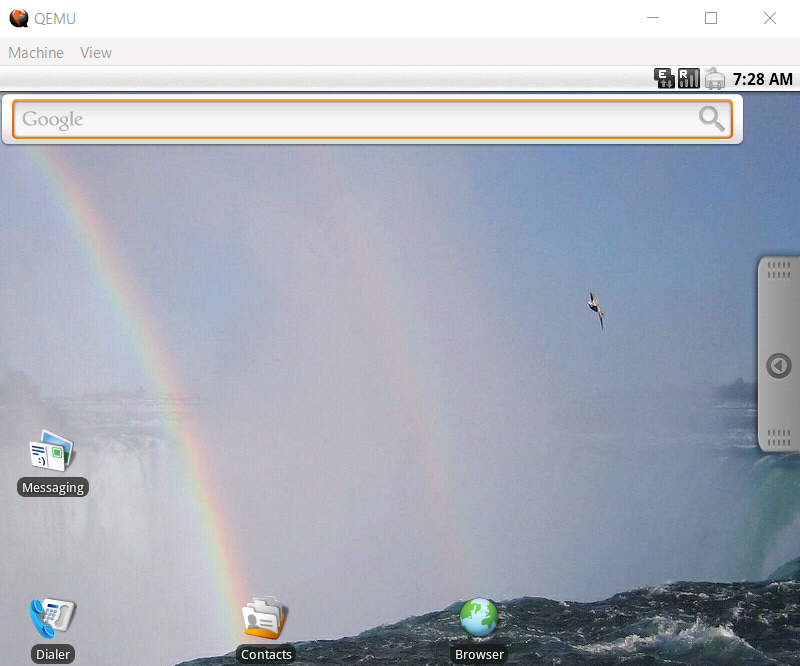

# QDroid
Android ADB-клиент на Python3 для QEMU


## Пример использования:

Запустите QEMU:
```
qemu-system-i386 -cdrom path/to/android.iso
```




Создание и подключение ADB клиента
```python
from droid import AndroidADBClient
adb = AndroidADBClient()
adb.connect_device()
```

Выполнение команды
```python
version = adb.run_adb_command("getprop ro.build.version.release")
print(f"Версия Android: {version}")
```

Установка APK
```python
adb.install_apk("path/to/app.apk")
```

Копирование файла с устройства
```python
adb.pull_file("/data/local/tmp/file.txt", "downloaded_file.txt")
```
